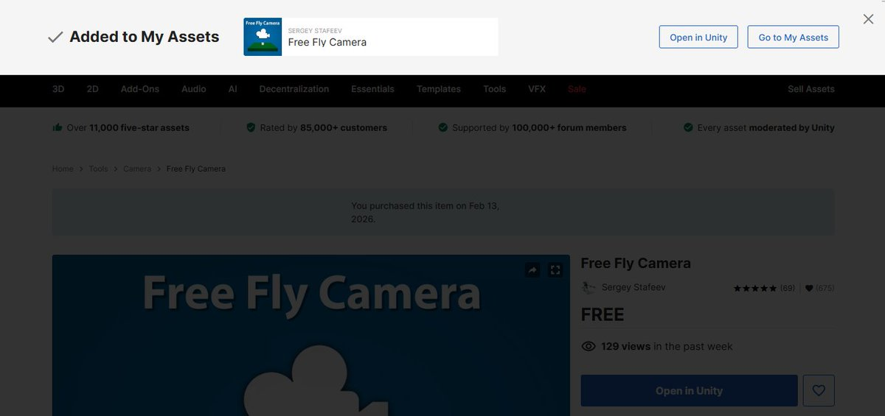
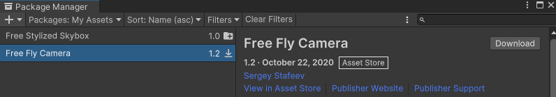
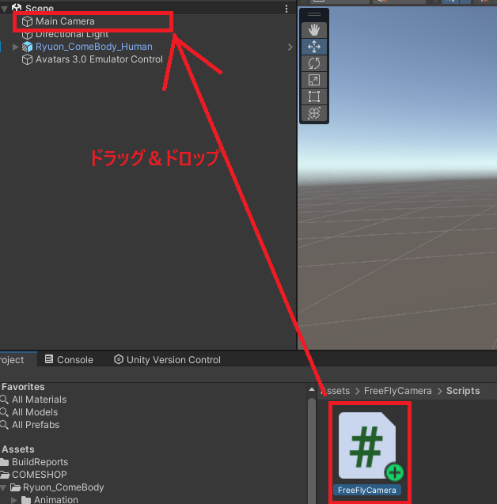
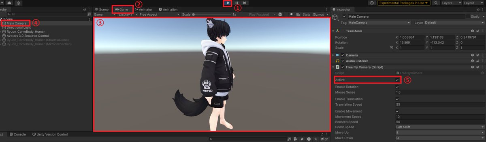
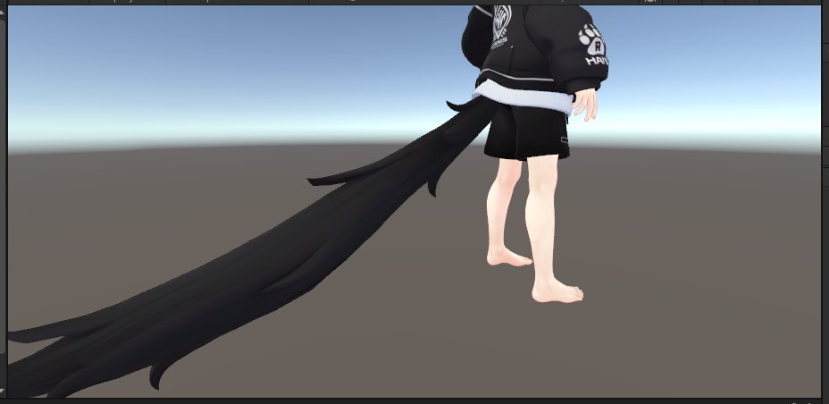

# Play Mode での伸び確認手順

## 事前準備

1. Unity Asset Store で FreeFlyCamera をプロジェクトに追加します。
2. Unity プロジェクト側で Download / Import します。
3. `Assets/FreeFlyCamera/Scripts/FreeFlyCamera` を `Main Camera` にドラッグ & ドロップします。

## Play Mode での確認

1. `Play` を押します。
2. `Game` ビューをクリックし、カーソルを消します。
3. `WASD` でカメラ移動し、確認したい尻尾/耳の近くまで寄ります。
4. `Esc` を押してカーソルを戻します。
5. `Main Camera` を選択し、`Active` をオフにします。
6. Scene で尻尾などをつかんで引っ張り、伸び方を確認します。

## チェック観点

- 想定どおりの最大伸びで止まるか
- 離したときに不自然な跳ね返りがないか
- 縮み側 (`Max Squish`) が過剰で見た目破綻しないか

## 関連

- [伸びるパーツ（尻尾・耳）の調整手順（PhysBone）](/avatar-customization/physbone/stretchable-parts-workflow)
