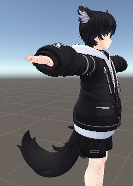
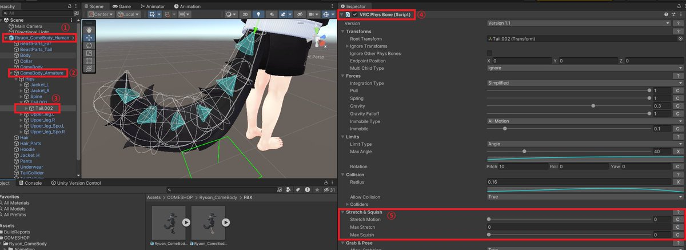
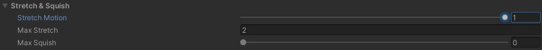

# 伸びるパーツ（尻尾・耳）の調整手順（PhysBone）

## 対象

- VRChat アバターの尻尾・耳など、ボーンが連なる揺れ物
- Unity 上で `VRC Phys Bone` を使っている構成

## 手順全体

1. アバターの対象ボーンまで辿る
2. `VRC Phys Bone` の `Stretch & Squish` を調整する
3. Play Mode で伸び挙動を確認する準備をする
4. Play Mode 上で実際に引っ張って挙動確認する

## 1. アバターの対象ボーンまで辿る

1. Unity の Hierarchy で自分のアバターを選択します。
2. `Armature` を展開します。
3. 尻尾または耳のボーンチェーンを探します。
4. 対象ボーンに付いている `VRC Phys Bone` コンポーネントまで移動します。

## 2. Stretch & Squish を調整する

`VRC Phys Bone` の `Stretch & Squish` セクションで主に次を調整します。

- `Stretch Motion`: 伸縮/変形への影響度合い
- `Max Stretch`: 伸びる最大量（元の骨長に対する倍率）
- `Max Squish`: 縮む最大量

パラメータの意味は詳細ページを参照してください。  
[Stretch & Squish パラメータ早見表](/avatar-customization/physbone/stretch-and-squish-parameters)

## 3. Play Mode で確認する準備

テスト手順の要点だけ先に示します。

1. FreeFlyCamera を導入して、`Main Camera` にアタッチします。
2. Play Mode で Game ビューをクリックし、`WASD` でカメラ移動できる状態にします。
3. 調整対象の近くまで寄ります。

詳細は次ページを参照してください。  
[Play Mode での伸び確認手順](/avatar-customization/physbone/playmode-stretch-test)

## 4. 実際に引っ張って確認する

1. `Esc` でカーソルを表示します。
2. `Main Camera` を選択します。
3. `Active` のチェックを外します。
4. Scene 上で尻尾などのボーンをつかんで引っ張り、伸び方を確認します。
5. 望む挙動になるまで `Stretch & Squish` の値を再調整します。

