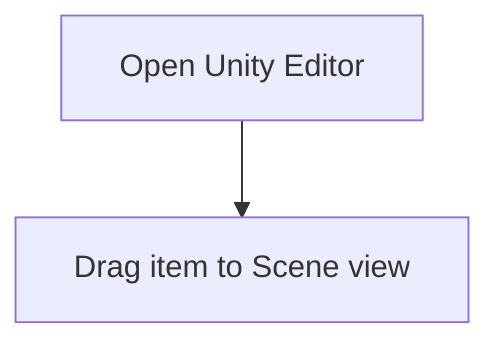

# Unity-Editor-Basic

<!-- scenario_id: unity-editor-basic -->

<video controls preload="metadata" style="max-width:100%">
  <source src="/guide-assets/unity-editor-basic/video/unity-basic-annotated.mp4" type="video/mp4">
</video>

## 1. Open Unity Editor

Launch Unity Editor and open the top menu.

## 2. Drag item to Scene view

Perform a drag gesture inside Unity Editor.

