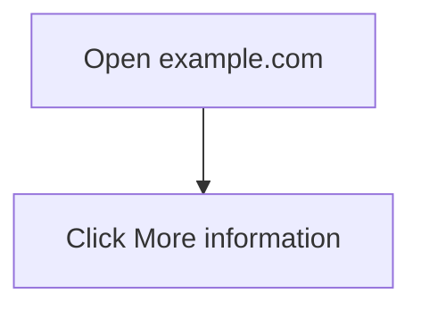

# Web-Example

<!-- scenario_id: web-example -->

<video controls preload="metadata" style="max-width:100%">
  <source src="/guide-assets/web-example/video/web-example-annotated.mp4" type="video/mp4">
</video>

## 1. Open example.com

Open the example website top page.

## 2. Click More information

Click the first link and open destination page.

